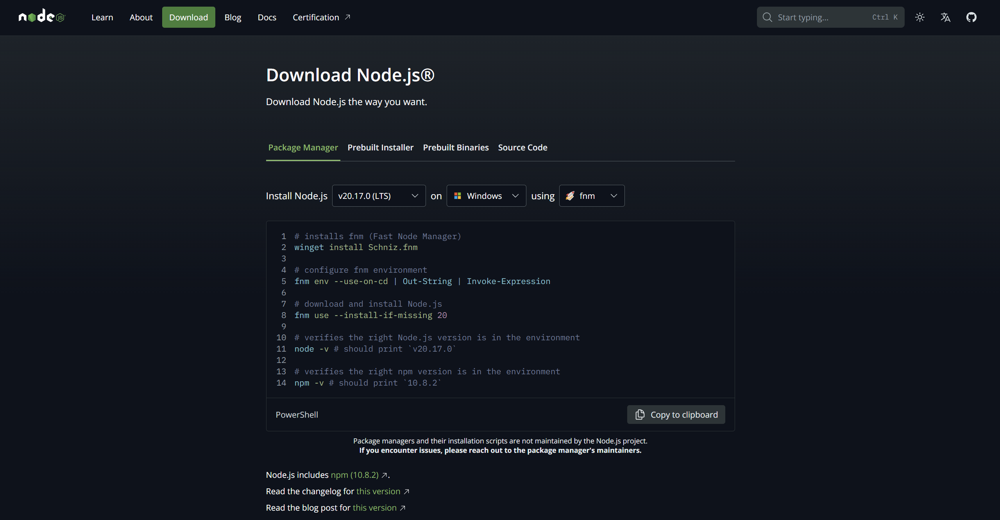
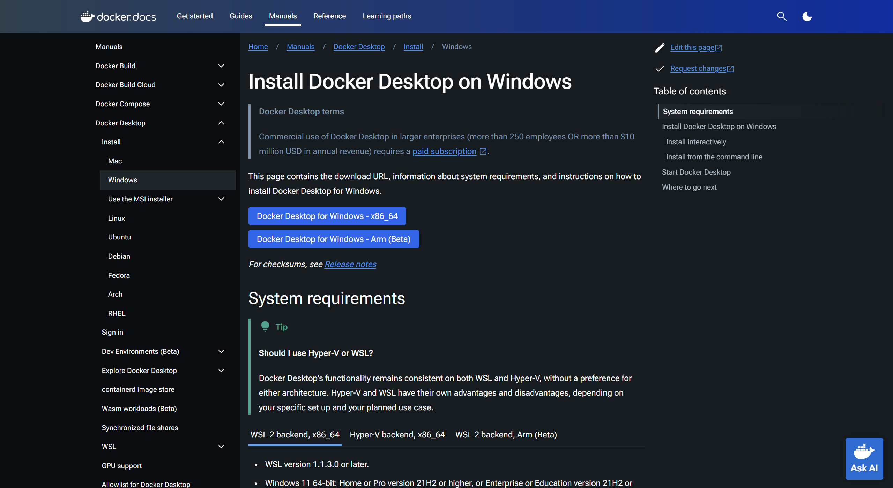
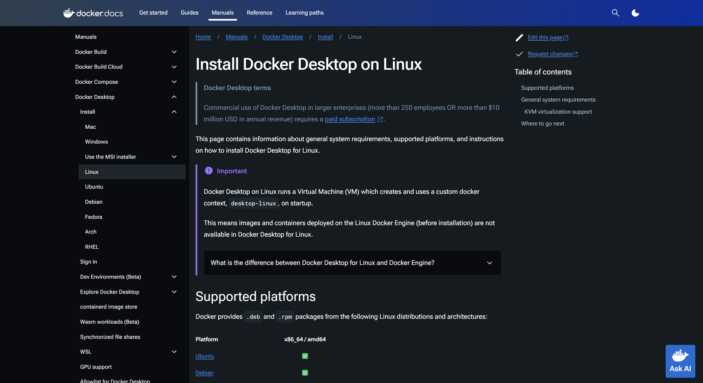
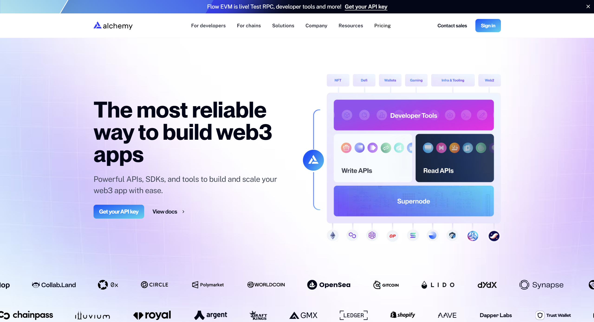

# Prerequisites

Ensure you have the following:

- **Node.js (v16.x or higher)**  
  Node.js is crucial for running the backend of this Ethereum Deposit Tracker because it allows us to use TypeScript, a powerful, type-safe language that compiles to JavaScript. It’s used for handling requests, interacting with the Ethereum RPC, and managing database operations. Make sure to install the latest LTS version to ensure compatibility.

- **Docker**  
  Docker helps us containerize the entire project, making it easier to deploy across different environments. It’s also needed for setting up Prometheus, Grafana, and cAdvisor for monitoring.

- **Alchemy API Key**  
  Required for interacting with the Ethereum blockchain, as Alchemy provides an Ethereum node to send and receive data through Ethereum RPC methods.

- **Telegram API Key**  
  If you want to receive alerts via Telegram, you’ll need a valid API key to connect the application to Telegram.

## Getting Node.js

To install Node.js, follow these steps:

1. Visit the [Node.js download page](https://nodejs.org/en/download/package-manager).
2. Select the appropriate package for your operating system.
3. Follow the instructions provided on the page to install Node.js using your system's package manager.

## Getting Docker

Docker is essential for containerizing this project and running the monitoring tools (Grafana, Prometheus, and cAdvisor) seamlessly. It allows the app to run consistently across different environments by packaging all the dependencies and configurations into containers.

To install Docker, follow these steps:

### For Windows:

1. Visit the [Docker Desktop installation page for Windows](https://docs.docker.com/desktop/install/windows-install/).
2. Download and install Docker Desktop for your system.
3. Follow the installation instructions to set it up.

### Alternatively, for Unix-based Systems (Linux/Mac):

1. Visit the [Docker installation page for Linux](https://docs.docker.com/desktop/install/linux-install/) or [Mac](https://docs.docker.com/desktop/install/mac-install/).
2. Follow the installation instructions for your specific distribution or OS.
3. For Linux, you may need to run additional commands to ensure your user has the proper permissions to run Docker without `sudo`. Check the documentation for post-installation steps.

## Getting an Alchemy API Key

To interact with the Ethereum blockchain, you’ll need an Alchemy API key. Follow these steps to get your API key:

1. **Sign up for an Alchemy account**  
   Head over to the [Alchemy website](https://www.alchemy.com/) and sign up for a free account if you don’t already have one.
   

2. **Create a new app**  
   Once logged in, navigate to the **Dashboard** and click on **Create App**.  
   

3. **Set up your app**  
   In the app creation dialog, provide a name for your app, select the **Ethereum** blockchain, choose the **Mainnet** network, and select your preferred development environment.

4. **Get your API key**  
   After creating the app, you’ll be directed to the app’s dashboard. Copy the **HTTP URL** or **API Key** provided. This key will be used to make requests to the Ethereum network.

5. **Integrate your API key**  
   Use the copied API key in your project’s environment variables or configuration file to connect to the Ethereum blockchain via Alchemy.

And you're all set! Now your Ethereum Deposit Tracker can interact with the blockchain via Alchemy’s services.

