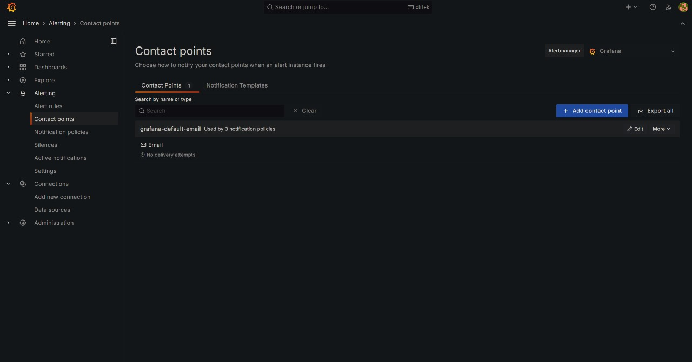
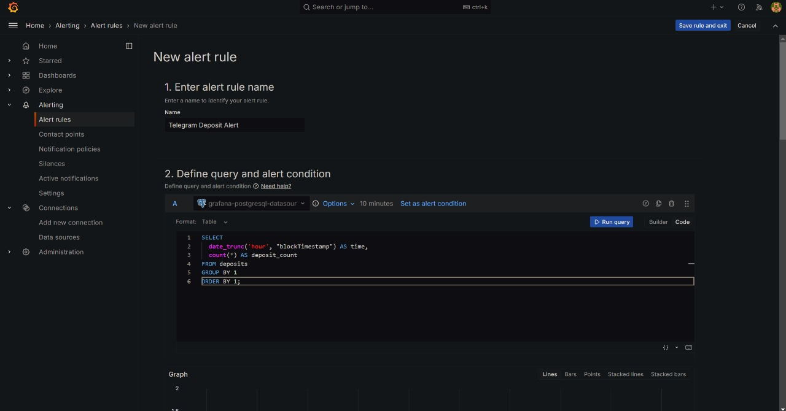
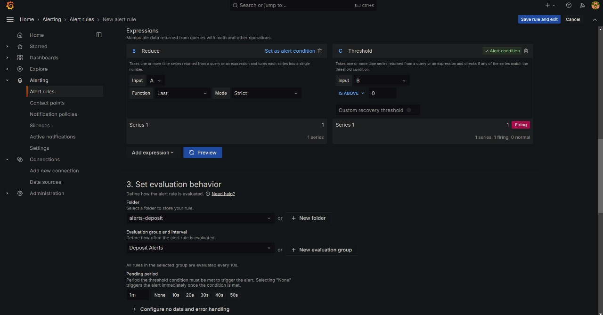
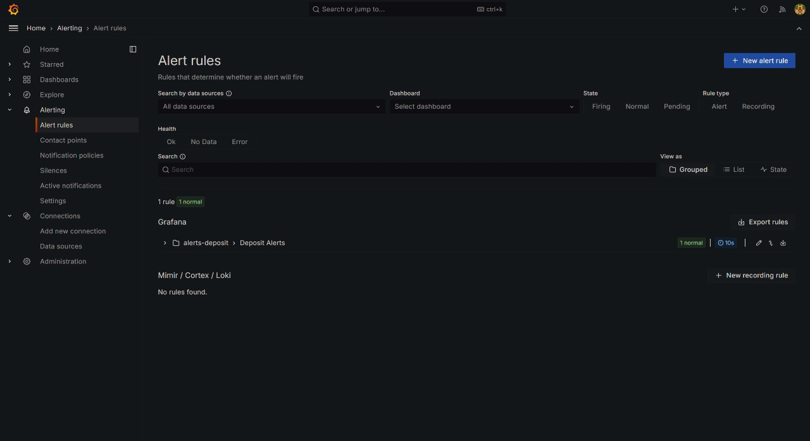
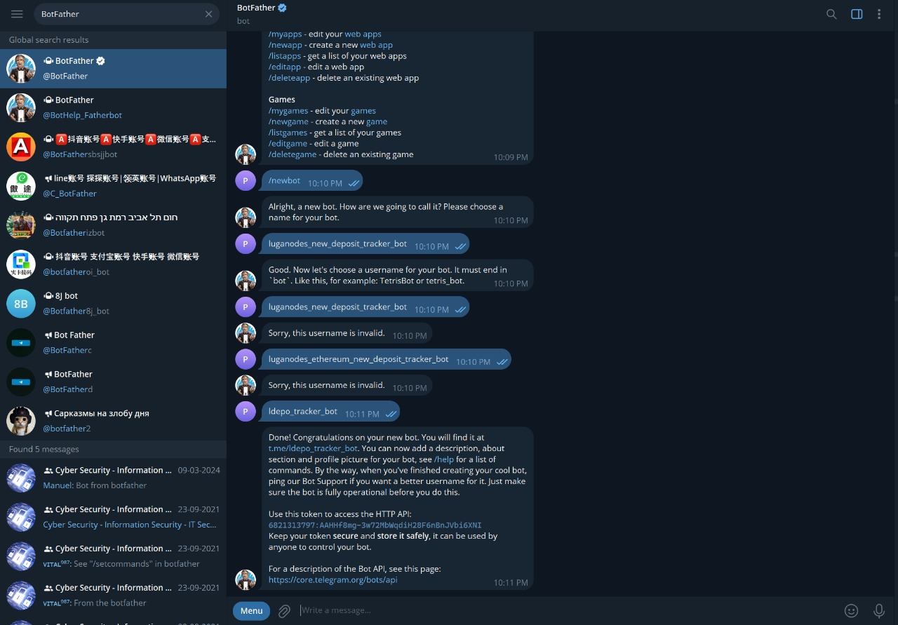
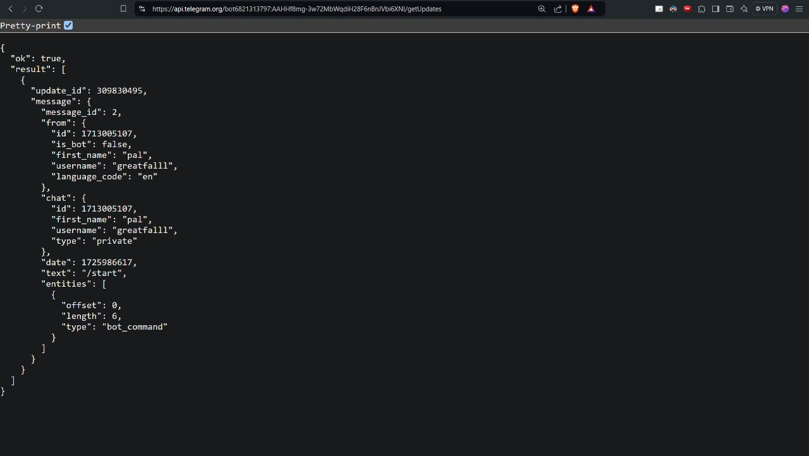
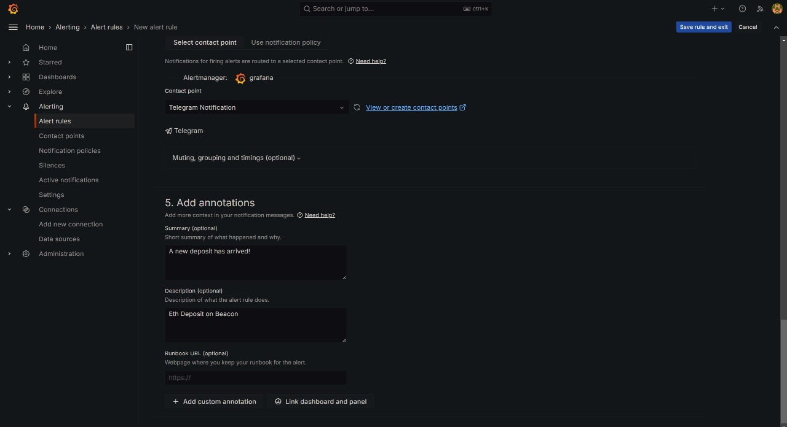
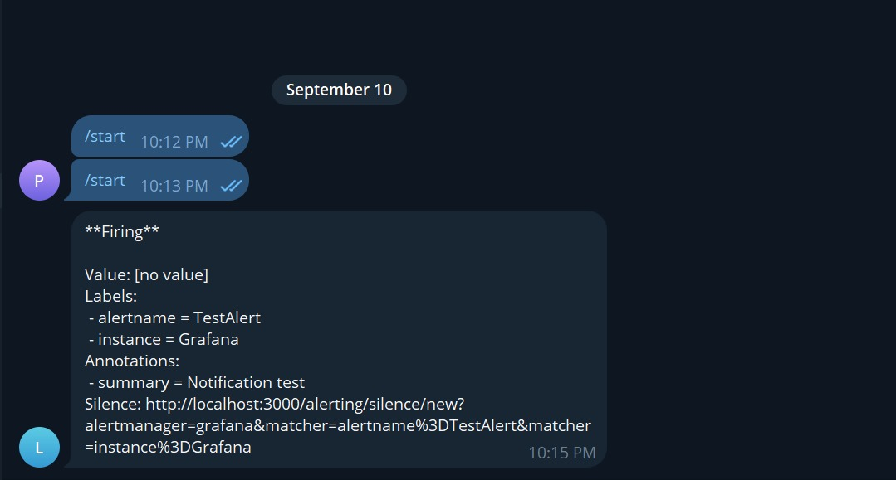

# Deposit Alerts

To set up repository push alerts via Telegram using Grafana, follow the steps below:

## 1. Access Alerting Section

- Visit the alerts section in Grafana at [http://localhost:3001/alerting/](http://localhost:3001/alerting/).
- Click on **New Alert**.


## 2. Create a New Alert

- Name the alert **Telegram Deposit Notification**.

## 3. Define Query and Alert Condition

- Add the following SQL query to monitor deposit activity:

  ```sql
  SELECT
    date_trunc('hour', "blockTimestamp") AS time,
    count(*) AS deposit_count
  FROM deposits
  GROUP BY 1
  ORDER BY 1;
  ```


## 4. Configure Labels and Notifications

- In the **Configure Labels and Notifications** section, click **View or create contact points**.



## 5. Add Contact Points for Telegram

- Add a contact point and set **Name** as `Telegram`. 
- Choose **Telegram** as the integration.


## 6. Obtain Telegram BOT API Token

- Use [@BotFather](https://telegram.me/BotFather) on Telegram to generate your bot and retrieve your **BOT API Token**.

  

## 7. Get Contact ID

- After receiving the API token from @BotFather, use it to get the contact ID by visiting the following URL in your browser, replacing `<YOUR_BOT_API_TOKEN>` with your actual token:

  ```
  https://api.telegram.org/bot<YOUR_BOT_API_TOKEN>/getUpdates
  ```

- This will return a response containing the **Chat ID**, which you will need for the alert configuration.
  

## 8. Enter These Details in Grafana

- Input both the **BOT API Token** and the **Chat ID** in the respective fields in Grafana.
  

## 9. Fire a Test Alert

- Once configured, trigger a test alert to verify the setup.
- Ensure the Telegram bot sends you the notification when the alert condition is met.
  


This setup allows you to receive push notifications through Telegram, keeping you updated on deposit events or changes in your repository.