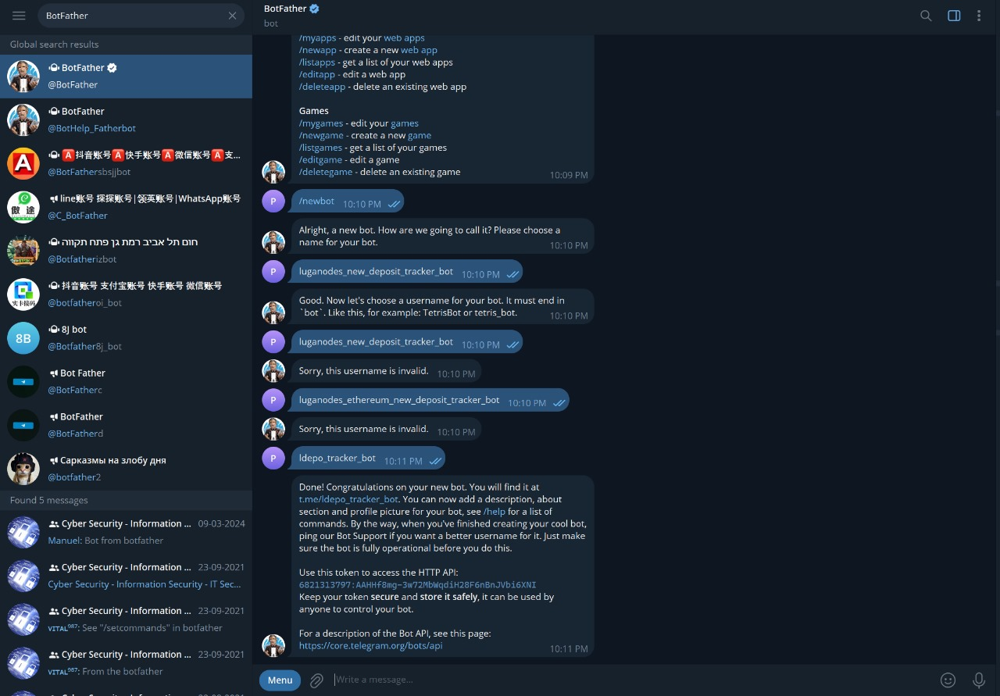
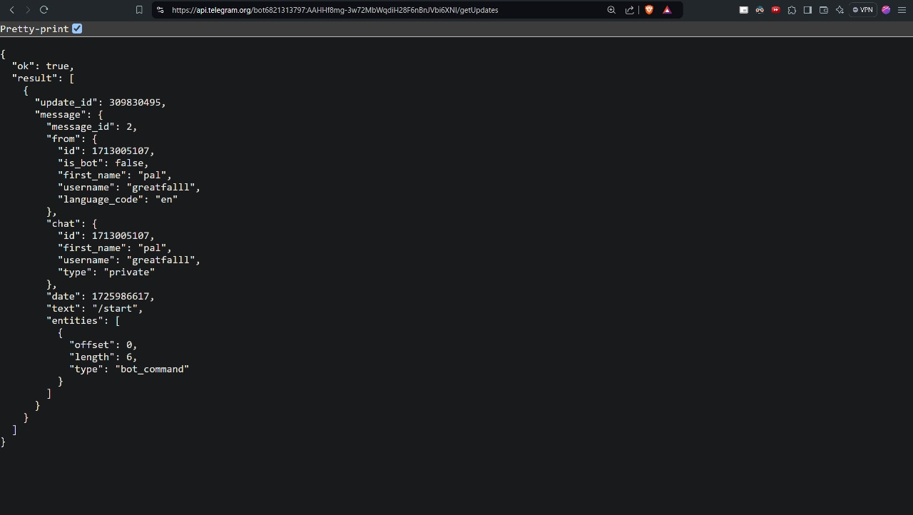
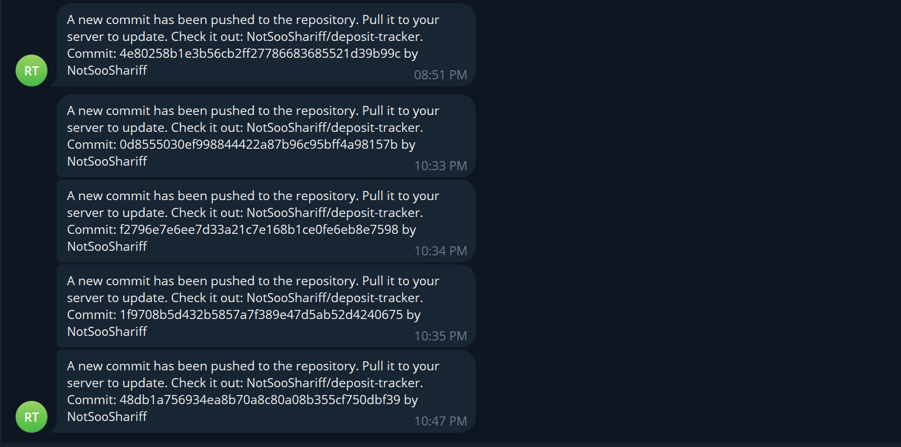

# Repository Push Alerts

Repository push alerts are essential for keeping track of changes to the repository, especially for users who have forked the project and are using it for internal purposes. With these alerts, you can be immediately notified when there are updates or new commits in the repository, allowing you to stay current without having to manually check for changes. This setup is ideal for 24/7 monitoring environments, where consistent updates are crucial to ensuring the system remains stable and up to date.

The GitHub workflows in the repository already automate this process, requiring only minimal setup to get notified on Telegram.

## 1. Set Up Telegram Bot

- Use [@BotFather](https://telegram.me/BotFather) to create a new Telegram bot.
- Retrieve the **BOT API Token** from @BotFather.

  

## 2. Get the Chat ID

- Once you have the **BOT API Token**, query the following URL in your browser to get the **Chat ID**, replacing `<YOUR_BOT_API_TOKEN>` with your actual token:

  ```
  https://api.telegram.org/bot<YOUR_BOT_API_TOKEN>/getUpdates
  ```

- The response will include the **Chat ID** you need for the setup.

  
## 3. Add Secrets in GitHub

- Navigate to your repository settings in GitHub.
- Go to **Settings > Secrets and Variables > Actions**.
- Click on **New Repository Secret** and add the following secrets:

  - **TELEGRAM_BOT_TOKEN**: Your Telegram bot's API token.
  - **TELEGRAM_CHAT_ID**: The chat ID you retrieved from the Telegram API.

With these secrets in place, GitHub workflows will use them to send push alerts to your Telegram bot whenever there are changes in the repository, keeping you informed in real time.


## 4. Test your configuration 

- Push a small change to the server to check if you're getting notified of the changes to the repository.


