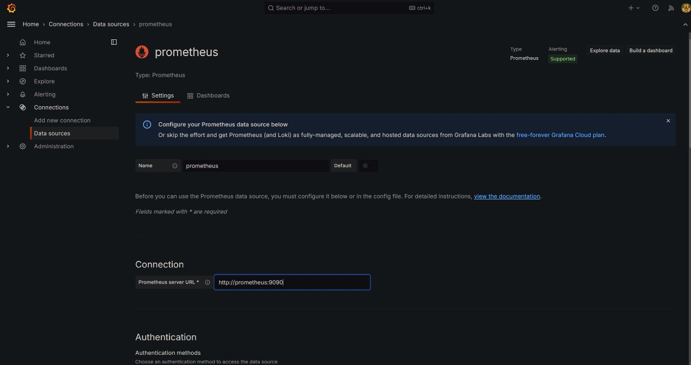

# Importing the cAdvisor Dashboard

To monitor container metrics using cAdvisor in Grafana, follow the steps below to import the official cAdvisor dashboard and configure Prometheus as the data source.

## 1. Import the cAdvisor Dashboard

- Open Grafana at `http://localhost:3001`.
- In the left sidebar, click on the **"+"** icon and select **"Import"**.
- In the "Import via Grafana.com" field, enter the dashboard ID `19792`.
- Click **"Load"**.

## 2. Configure Prometheus as a Data Source

Once the dashboard is loaded, you'll need to configure Prometheus as the data source for Grafana to fetch metrics from cAdvisor:

- On the **Prometheus** dropdown, click to configure a new data source.
- Select **"Prometheus"** from the list of data sources.

### Prometheus Data Source Configuration:

- **URL:** Enter `http://prometheus:9090` as the Prometheus server URL.
- Click **"Save & Test"** to confirm the configuration.

## 3. Finalize the cAdvisor Dashboard Import

- After successfully configuring Prometheus, return to the dashboard import screen.
- Complete the import process, and the cAdvisor dashboard will be available with real-time container metrics.

Now, the cAdvisor dashboard is set up, and you'll be able to monitor your Docker container performance through Grafana.