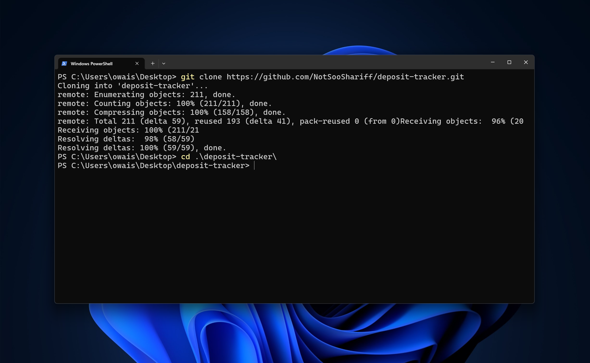

---

sidebar_position: 1

--- 

# Clone the Repository Locally

Cloning a repository is the first step in setting up your local development environment for the Ethereum Deposit Tracker. This guide will help you understand how to clone the repository and where to place it depending on your operating system and environment.

## Prerequisites

Before cloning the repository, ensure you have Git installed on your system. You can check if Git is installed by running:

```bash
git --version
```

If Git is not installed, download and install it from the [official Git website](https://git-scm.com/downloads).

## Cloning the Repository

To clone the Ethereum Deposit Tracker repository, open your terminal or command prompt and run the following command:

```bash
git clone https://github.com/NotSooShariff/deposit-tracker
cd deposit-tracker
```

This command will create a local copy of the repository on your machine.



## Placement of the Repository

### On Windows Servers

When cloning the repository on a Windows server, you should choose a directory that is appropriate for your development or deployment setup. Here are some common locations:

- **For Development:** Place the repository in a directory within your user folder, such as `C:\Users\<YourUsername>\Documents\DepositTracker`. This keeps your files organized and separate from system files.

- **For Deployment:** If deploying to a server, consider placing the repository in a directory that is accessible to your web server or application server. For example, `C:\inetpub\wwwroot\DepositTracker` is a common location for IIS deployments.

Ensure the directory has appropriate permissions for the web server or application to read and write files as needed.

### General Placement Guidelines

- **Project Organization:** For better organization, you might place your repositories in a dedicated development directory, such as `~/projects/` on Unix-based systems or `C:\Projects\` on Windows.

- **Version Control:** Keep the repository in a location that is easy to access for version control operations, such as commits and pulls.

- **Backup and Security:** Ensure that the directory where you place your repository is included in your backup routines. Additionally, protect sensitive information and keys by using proper security practices.

## Technical Details

- **Git Configuration:** After cloning, you might want to configure Git with your name and email to personalize your commits. You can do this by running:

  ```bash
  git config --global user.name "Your Name"
  git config --global user.email "you@example.com"
  ```

- **Branch Management:** Check out the relevant branches for development or production use. For example, if you are working on a feature branch, you can switch to it using:

  ```bash
  git checkout feature-branch-name
  ```

- **Remote Management:** Ensure you regularly fetch and pull changes from the remote repository to keep your local copy up to date:

  ```bash
  git fetch origin
  git pull origin main
  ```

By following these guidelines, you can effectively manage and maintain your local copy of the Ethereum Deposit Tracker repository, whether for development or deployment purposes.