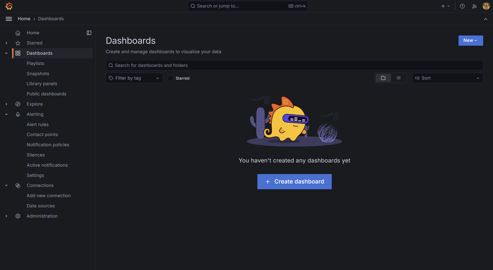
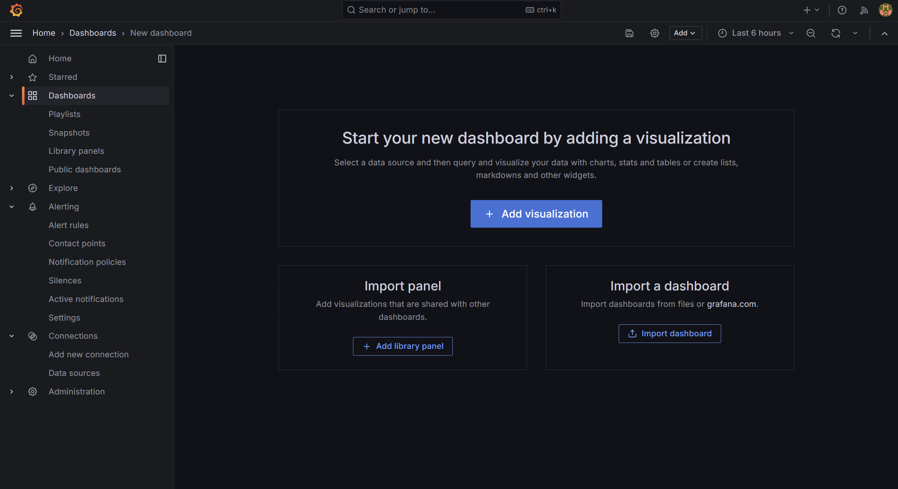
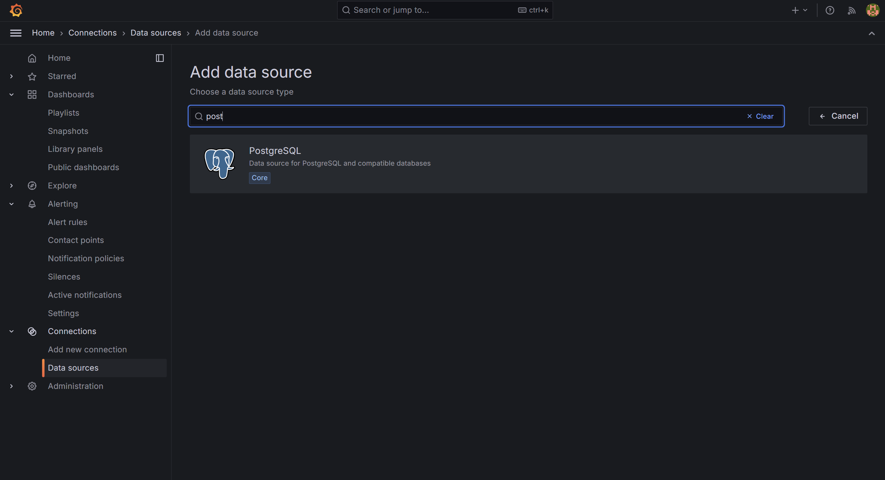
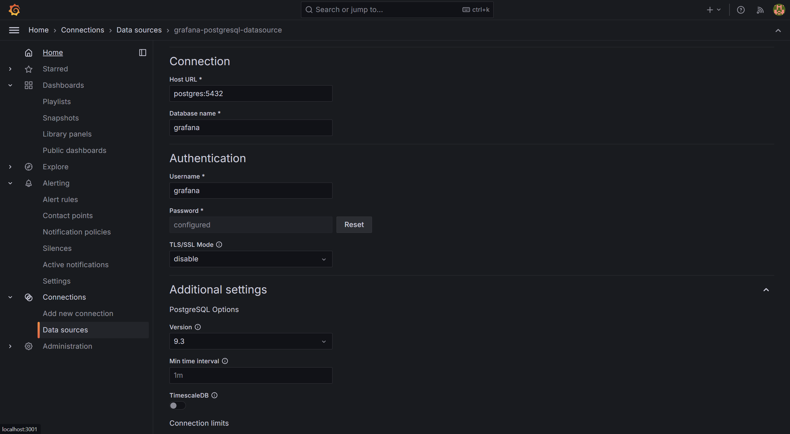
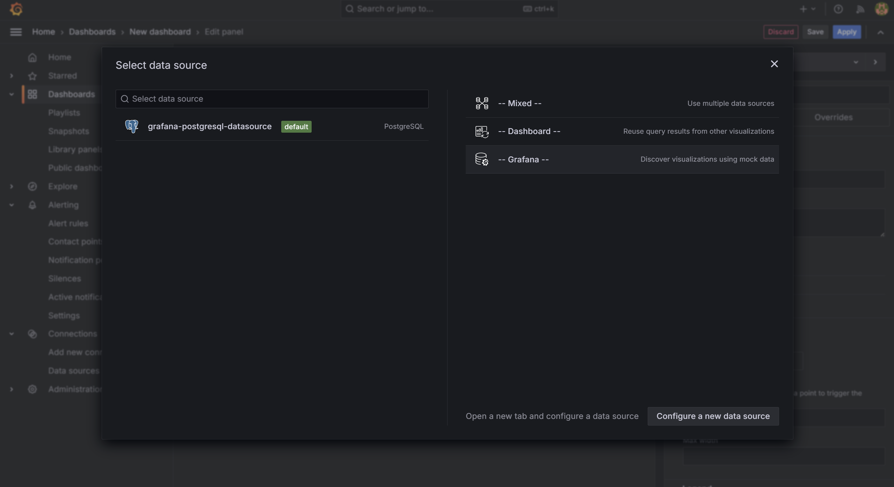

---
sidebar_position: 6
--- 

# Create a Deposits Dashboard 

To visualize deposit data in Grafana, follow these steps to create and configure a dashboard:

## 1. Access Grafana

Open your web browser and navigate to `http://localhost:3001/login`.

- **Email:** `admin`
- **Password:** `admin`


## 2. Create a New Dashboard

Once logged in, you will be on the Grafana home page. To start creating a new dashboard:

- Navigate to [http://localhost:3001/dashboards](http://localhost:3001/dashboards).
  
- Select **"Add Visualisation"** from the dropdown options.
- 
- Add new data source by navigating to [http://localhost:3001/connections/datasources/new](http://localhost:3001/connections/datasources/new)
 ![alt text](img/add-datasource.png

## 3. Add PostgreSQL as a Data Source

To connect Grafana to your PostgreSQL database where deposit data is stored:

- Select **"PostgreSQL"** from the list of available data sources.
  

## 4. Configure the PostgreSQL Data Source

In the data source settings, enter the following information:

- **Connection**
  - **Host URL:** `postgres:5432`
  - **Database name:** `grafana`

- **Authentication**
  - **Username:** `grafana`
  - **Password:** `grafana`

- `Disable` SSL if Required



After filling in these details, click **"Save & Test"** to verify the connection.

## 5. Add a Visualization to the Dashboard

With the data source configured, you can now add visualizations to your dashboard:

- Go back to your newly created dashboard by clicking on the **"Dashboard"** tab.
- Click **"Add new panel"** to create a new visualization.
- In the **"Query"** section, select **"PostgreSQL"** as your data source.
  
- Enter a query to retrieve deposit data. For example:

  ```sql
  SELECT * FROM deposits
  ```

- Click **"Run Query"** to execute the query and fetch data.
- Switch to the **"Table"** visualization to view the data in a tabular format.

## 6. Save the Dashboard

Once you’ve added your desired visualizations:

- Click **"Save dashboard"** at the top of the page.
- Enter a name for your dashboard and click **"Save"**.

Your dashboard is now set up to view deposit data from your PostgreSQL database. You can customize it further by adding more panels, adjusting queries, and configuring various visualization options to suit your needs.