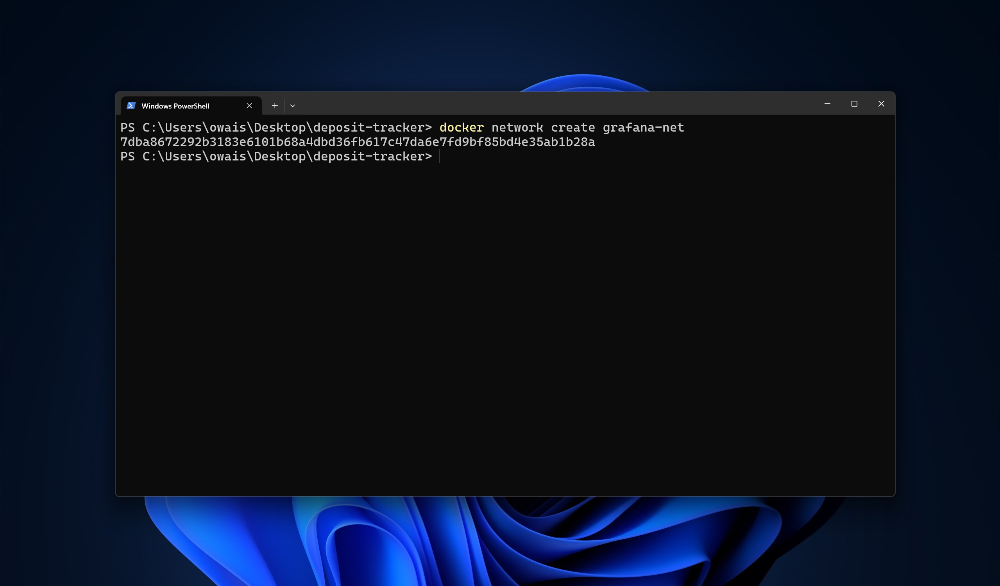

---
sidebar_position: 2
--- 

# Create a Docker Network for Grafana


Docker networks are crucial for containerized applications, especially when multiple containers need to communicate securely and efficiently. This guide will walk you through creating a Docker network specifically for Grafana, ensuring that it can interact with other containers such as Prometheus or cAdvisor.

## Steps to Create a Docker Network

1. **Create the Network**

   Execute the following command to create a new Docker network named `grafana-net`. This network will serve as the communication bridge for your Grafana setup and other related containers.

   ```bash
   docker network create grafana-net
   ```
    
   The `docker network create` command sets up a new network named `grafana-net`. This network will be used to isolate and manage the connections between your Grafana container and other services.

   

2. **Verify Network Creation**

   To confirm that the network was created successfully, list all Docker networks with:

   ```bash
   docker network ls
   ```

   This command will display all Docker networks on your system, including `grafana-net`. Ensure that `grafana-net` appears in the list.

3. **Run Containers on the Network (If necessary)**

   If you're deploying containers need to communicate with Grafana, specify the `grafana-net` network. For example, to start a Grafana container, use:

   ```bash
   docker run -d --name grafana --network grafana-net grafana/grafana
   ```

   - `-d`: Runs the container in detached mode.
   - `--name grafana`: Assigns a name to the container.
   - `--network grafana-net`: Connects the container to the `grafana-net` network.
   - `grafana/grafana`: Specifies the Docker image for Grafana.

   Similarly, connect other containers to this network by using the `--network grafana-net` option when running them.

4. **Inspect the Network (If necessary)**

   To examine the details of the `grafana-net` network, including connected containers, use:

   ```bash
   docker network inspect grafana-net
   ```

   This command provides detailed information about the network, including the containers that are currently connected.

5. **Remove the Network (If necessary)**

   If you need to remove the network, ensure no containers are using it, then execute:

   ```bash
   docker network rm grafana-net
   ```

   Be cautious with this command, as it will disconnect any containers still attached to the network.

