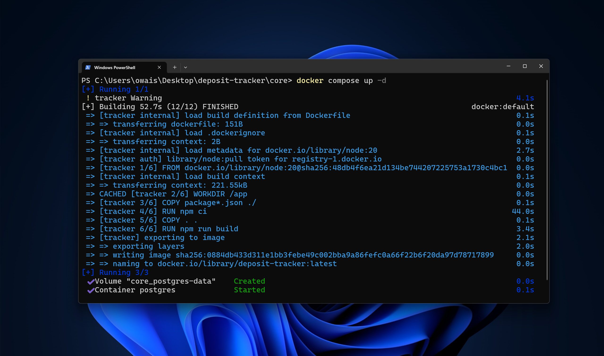

# Start Core

With the visualization tools running, the next step is to initiate the core tracking engine, which is responsible for monitoring and processing data from the Node that we have been asked to connect to. This component is essential for ensuring that your data flows correctly into Grafana and Prometheus for visualization and analysis.

## Navigate to Core Directory

First, navigate to the `core` directory:

```bash
cd core/
```

## Start the Core Container

To start the core tracking engine, use Docker Compose. This will set up the container with the configurations specified in your `docker-compose.yml` file. Run:

```bash
docker compose up -d
```



The core component connects to the Ethereum node via RPC (Remote Procedure Call) and relays the information over the Docker network. This setup allows seamless communication between services and ensures that the data tracking process is efficiently managed within your Docker environment.


