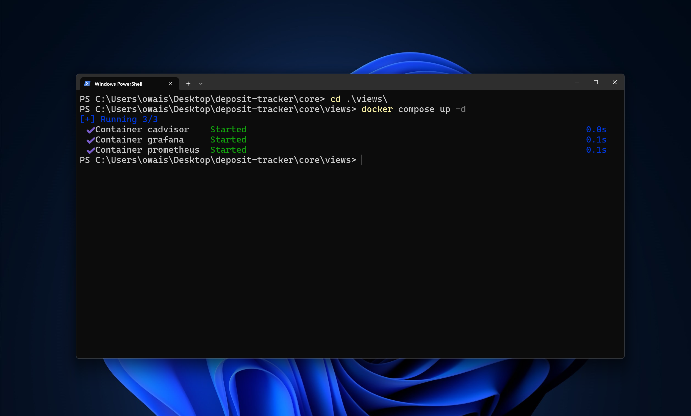
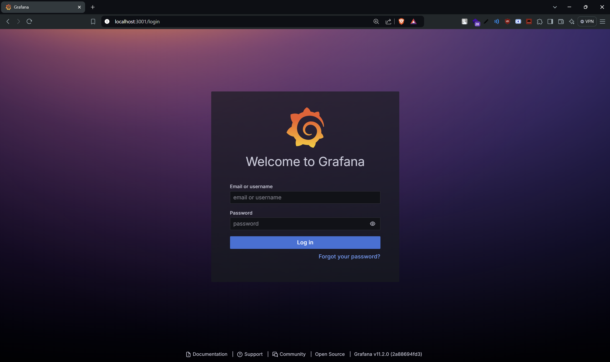

---
sidebar_position: 4
--- 
# Start Views

This section explains how to start the Docker containers for visualization tools such as Grafana, Prometheus, and cAdvisor. Follow the instructions below to get your monitoring and visualization services up and running.

## Steps to Start Docker Containers

1. **Navigate to the Views Directory**

   Open your Command Prompt or PowerShell and navigate to the `views` directory, where the Docker Compose configuration for your visualization tools is located:

   ```cmd
   cd .\views\
   ```

   This command changes the current directory to `views`, where your `docker-compose.yml` file is expected to be located.

2. **Start the Docker Containers**

   Use Docker Compose to start the containers in detached mode:

   ```cmd
   docker compose up -d
   ```

   This command starts the containers in the background, allowing you to continue using the terminal for other tasks. Docker Compose will handle the orchestration of the services defined in the `docker-compose.yml` file.

   


## Verify connectivity

To ensure that the containers have been pulled and are running correctly, you can verify their connectivity in two ways:

1. **Using the `curl` command:**

   Open your terminal and run the following command:

   ```bash
   curl http://localhost:3001
   ```

   This command sends a request to your local server on port 3001. If the containers are up and running, you should receive a response indicating that the Grafana service is available.

   Output: 
   ```
    StatusCode        : 200
    StatusDescription : OK
    Content           : <!DOCTYPE html>
                        <html lang="en-US">
                          <head>
    
                            <meta charset="utf-8" />
                            <meta http-equiv="X-UA-Compatible" content="IE=edge,chrome=1" />
                            <meta name="viewport" content="width=device-widt...
    RawContent        : HTTP/1.1 200 OK
                        X-Content-Type-Options: nosniff
                        X-Frame-Options: deny
                        X-Xss-Protection: 1; mode=block
                        Transfer-Encoding: chunked
                        Cache-Control: no-store
                        Content-Type: text/html; charset=UTF-8
                        D...
    Forms             : {}
    Headers           : {[X-Content-Type-Options, nosniff], [X-Frame-Options, deny], [X-Xss-Protection,
                        1; mode=block], [Transfer-Encoding, chunked]...}
    Images            : {}
    InputFields       : {}
    Links             : {@{innerHTML=
                                    supported browsers; innerText= supported browsers; outerHTML=<a href=
                        "https://grafana.com/docs/grafana/latest/installation/requirements/#supported-web
                        -browsers">
                                    supported browsers</a>; outerText= supported browsers; tagName=A; hre
                        f=https://grafana.com/docs/grafana/latest/installation/requirements/#supported-we
                        b-browsers}}
    ParsedHtml        : mshtml.HTMLDocumentClass
    RawContentLength  : 38671
   ```

2. **Navigating in a browser:**

   Alternatively, you can open your web browser and go to `http://localhost:3001`. This URL should display the Grafana dashboard if everything is set up correctly.



## Services Started

- **Grafana**: Access Grafana at `http://localhost:3001`. The port 3001 is used to avoid conflicts with other services such as Docusaurus or frontend servers like Next.js.
- **Prometheus**: Access Prometheus at `http://localhost:9090`. This port is standard for Prometheus and allows you to monitor metrics and query data.
- **cAdvisor**: Access the cAdvisor UI at `http://localhost:8080`. cAdvisor provides real-time monitoring of container resource usage and performance.

For more information on configuring or using these tools, refer to their respective documentation:

- [Grafana Documentation](https://grafana.com/docs/)
- [Prometheus Documentation](https://prometheus.io/docs/)
- [cAdvisor Documentation](https://github.com/google/cadvisor)
